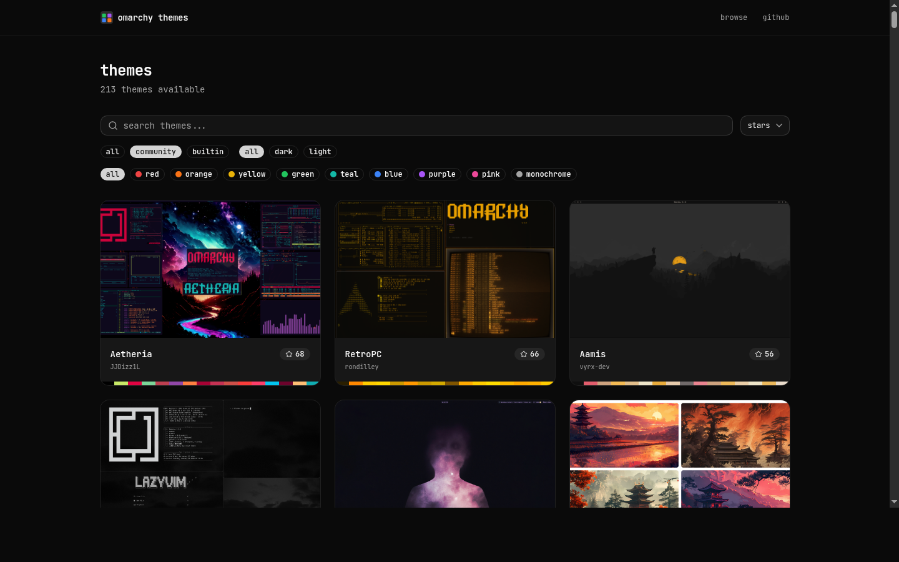

# omarchy themes

> Browse, search, and preview community themes for [Omarchy](https://omarchy.org). Filter by color, sort by popularity, and install with one command.

## Features

- **Color filtering** — browse themes by hue: red, orange, yellow, green, teal, blue, purple, pink, or monochrome
- **Live color previews** — see the full 16-color terminal palette on every theme card
- **Search and sort** — find themes by name, sort by stars, newest, or alphabetically
- **One-command install** — `omarchy-theme-install <repo-url>.git`
- **200+ community themes** — and growing, with new submissions welcome

## Submit a Theme

Have a theme you'd like listed? [Open a submission](https://github.com/limehawk/omarchy-theme-website/issues/new?template=submit-theme.yml) — just provide your repo URL and theme name.

Your repo needs a `colors.toml` at the root with the standard Omarchy color keys. A `preview.png` and `README.md` are recommended. See [CONTRIBUTING.md](CONTRIBUTING.md) for details.

## Disclaimer

omarchytheme.com is an independent community site, not affiliated with or endorsed by the Omarchy project or 37signals.

## License

MIT
